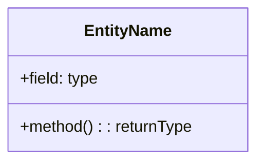

# REASONS Canvas: {Feature Name}

## R — Requirements

<!-- The "why": business goals, scope, and success criteria -->

### Business Context

{Why this exists. What problem it solves. Who benefits.}

### Scope

**IN:**

- {item 1}
- {item 2}

**OUT:**

- {item 1}
- {item 2}

### Success Criteria

- [ ] {criterion 1}
- [ ] {criterion 2}

### Constraints

| Type       | Constraint   | Source                  |
| ---------- | ------------ | ----------------------- |
| Technical  | {constraint} | {contract/standard/ADR} |
| Business   | {constraint} | {source}                |
| Governance | {constraint} | {policy}                |
| Design     | {constraint} | {brand/accessibility}   |

---

## E — Entities

<!-- Domain model: what concepts are involved -->



### Entity Definitions

| Entity | Purpose   | Key Fields | Relationships   |
| ------ | --------- | ---------- | --------------- |
| {name} | {purpose} | {fields}   | {relationships} |

---

## A — Approach

<!-- Solution strategy and trade-offs -->

### Strategy

{High-level approach: synchronous vs async, event-driven vs request-response, etc.}

### Trade-offs

| Decision   | Chosen   | Rejected   | Reason   |
| ---------- | -------- | ---------- | -------- |
| {decision} | {chosen} | {rejected} | {reason} |

### Architecture Impact

- **Packages affected:** {list}
- **Routes affected:** {list}
- **Contracts affected:** {list}
- **Database changes:** {yes/no, describe}

---

## S — Structure

<!-- Architecture, dependencies, file layout -->

### File Layout

```
{path}/
  ├── {file1}     # {purpose}
  ├── {file2}     # {purpose}
  └── {file3}     # {purpose}
```

### Dependencies

| Component   | Depends On   | Type                    |
| ----------- | ------------ | ----------------------- |
| {component} | {dependency} | import / runtime / data |

### Interfaces

```typescript
// {InterfaceName} — {purpose}
interface {InterfaceName} {
  {method}(params): ReturnType;
}
```

---

## O — Operations

<!-- Precise implementation tasks in order -->

### Step 1: {Operation Name}

1. **Responsibility:** {what this does}
2. **Location:** `{file path}`
3. **Dependencies:** {what it needs}
4. **Input:** {what goes in}
5. **Output:** {what comes out}
6. **Error handling:** {what happens on failure}

### Step 2: {Operation Name}

1. **Responsibility:** {what this does}
2. **Location:** `{file path}`
3. **Dependencies:** {what it needs}
4. **Input:** {what goes in}
5. **Output:** {what comes out}
6. **Error handling:** {what happens on failure}

### Execution Order

```text
Step 1 → Step 2 → Step 3
```

{Steps must be sequential where dependencies exist. Parallelizable steps noted explicitly.}

---

## N — Norms

<!-- Coding standards and patterns to follow -->

### Code Standards

- Follow `standards/` engineering standards
- Follow existing patterns in `packages/` for similar code
- Follow `CONTRACT.md` for any affected packages

### Design Standards

- Follow `packages/platform-ui/` design tokens
- Follow Bhavya brand: forest/ivory/earth/gold palette
- Follow typography: Playfair Display + Inter

### Bhavya-Specific Norms

- No purple/blue AI gradients
- No fabricated institutional data
- No duplicate type definitions (use `@bhavya/shared`)
- No app-to-app dependencies
- One concept → one route

---

## S — Safeguards

<!-- What must NOT be done: negative space constraints -->

### Hard Constraints (must not violate)

- Do not {action 1}
- Do not {action 2}
- Do not modify {protected thing}

### Scope Boundaries

- Do not touch files outside `{directory}`
- Do not refactor {existing system} as part of this change
- Do not add new dependencies unless justified

### Quality Boundaries

- Do not weaken types to make code compile
- Do not swallow errors
- Do not add placeholder/stub implementations
- Do not introduce patterns not already used in the codebase

### Anti-Slop Check

Before implementation, verify against AntiSlop Tier 2 rules:

- [ ] R-A1: Smallest viable change made
- [ ] R-A2: Existing patterns reused
- [ ] R-A3: No unjustified dependencies
- [ ] R-A4: No invented architecture
- [ ] R-A5: Errors investigated, not swallowed
- [ ] R-A6: Types not weakened for compilation
- [ ] R-A7: Diff inspected before completion

---

## Verification Requirements

### Before Implementation

- [ ] Canvas reviewed by human
- [ ] Repository state inspected (actual code, not assumptions)
- [ ] Existing contracts checked
- [ ] Existing patterns identified for reuse

### After Implementation

- [ ] AntiSlop gate passes (`pnpm antislop`)
- [ ] Typecheck passes (`pnpm typecheck`)
- [ ] Lint passes (`pnpm lint`)
- [ ] Tests pass (`pnpm test`)
- [ ] Build succeeds (`pnpm build`)
- [ ] Canvas matches implementation (drift check)

### Drift Detection

After implementation, compare canvas against actual code:

| Canvas Says   | Code Actually Does | Status        |
| ------------- | ------------------ | ------------- |
| {expectation} | {reality}          | MATCH / DRIFT |

If drift detected: investigate discrepancy before marking complete.

---

## Design Contract Summary

| Field                | Value                             |
| -------------------- | --------------------------------- |
| **Task ID**          | {TASK-NNN}                        |
| **Status**           | draft / in-progress / implemented |
| **Owner**            | {name}                            |
| **Created**          | {date}                            |
| **Last verified**    | {date}                            |
| **Repository state** | {commit hash or "current"}        |

---

New canvas = copy this file to `specs/{feature-slug}-reasons-canvas.md`.
Status lifecycle: `draft → in-progress → implemented` (one line per canvas; the `status:` frontmatter is the state surface).
Lightweight mode: For bug fixes and small changes, fill only R (Requirements), O (Operations), S (Safeguards). Skip E, A, N if not needed.
Full mode: For substantial features, fill all seven dimensions.
