# Concept Map: Operating System Navigation

**Knowledge Package:** KP-002  
**Last Updated:** August 5, 2026  

---

## Mermaid Diagram

```mermaid
graph TB
    subgraph "Operating System Navigation"
        A[Operating System]
    end

    subgraph "Desktop Interface"
        B[Desktop Interface]
        B1[Taskbar]
        B2[Start Menu]
        B3[Desktop Icons]
        B4[System Tray]
        B5[Wallpaper]
    end

    subgraph "Window Management"
        C[Window Management]
        C1[Minimize]
        C2[Maximize]
        C3[Close]
        C4[Resize]
        C5[Move]
        C6[Arrange]
        C7[Switch Windows]
    end

    subgraph "System Settings"
        D[System Settings]
        D1[Display Settings]
        D2[Sound Settings]
        D3[Network Settings]
        D4[Privacy Settings]
        D5[Personalization]
    end

    subgraph "Task Manager"
        E[Task Manager]
        E1[Processes]
        E2[CPU Usage]
        E3[Memory Usage]
        E4[Disk Usage]
        E5[Network Usage]
    end

    subgraph "Keyboard Shortcuts"
        F[Keyboard Shortcuts]
        F1[Copy/Paste]
        F2[Switch Windows]
        F3[System Functions]
        F4[Navigation]
        F5[Editing]
    end

    A --> B
    A --> C
    A --> D
    A --> E
    A --> F

    B --> B1
    B --> B2
    B --> B3
    B --> B4
    B --> B5

    C --> C1
    C --> C2
    C --> C3
    C --> C4
    C --> C5
    C --> C6
    C --> C7

    D --> D1
    D --> D2
    D --> D3
    D --> D4
    D --> D5

    E --> E1
    E --> E2
    E --> E3
    E --> E4
    E --> E5

    F --> F1
    F --> F2
    F --> F3
    F --> F4
    F --> F5

    C7 -.-> F2
    D1 -.-> B5
    E1 -.-> A
```



---

## Relationship Descriptions

### Core Relationships

| From | To | Relationship | Description |
|------|-----|--------------|-------------|
| Operating System | Desktop Interface | contains | The OS provides the desktop environment |
| Operating System | Window Management | enables | The OS manages windows on screen |
| Operating System | System Settings | includes | Settings configure OS behavior |
| Operating System | Task Manager | provides | Task Manager monitors OS processes |
| Operating System | Keyboard Shortcuts | supports | Shortcuts control OS functions |

### Component Relationships

| From | To | Relationship | Description |
|------|-----|--------------|-------------|
| Desktop Interface | Taskbar | contains | Taskbar is part of the desktop |
| Desktop Interface | Start Menu | contains | Start Menu is accessed from desktop |
| Desktop Interface | Desktop Icons | contains | Icons are displayed on desktop |
| Desktop Interface | System Tray | contains | System tray shows in taskbar |
| Window Management | Minimize | includes | Minimize is a window action |
| Window Management | Maximize | includes | Maximize is a window action |
| Window Management | Close | includes | Close ends a window |
| System Settings | Display Settings | includes | Display is a settings category |
| System Settings | Sound Settings | includes | Sound is a settings category |
| System Settings | Network Settings | includes | Network is a settings category |
| System Settings | Privacy Settings | includes | Privacy is a settings category |
| Task Manager | Processes | monitors | Task Manager shows processes |
| Task Manager | CPU Usage | monitors | Task Manager tracks CPU |
| Task Manager | Memory Usage | monitors | Task Manager tracks memory |
| Keyboard Shortcuts | Copy/Paste | includes | Copy/paste are shortcuts |
| Keyboard Shortcuts | Switch Windows | includes | Window switching is a shortcut |

### Cross-Concept Relationships

| From | To | Relationship | Description |
|------|-----|--------------|-------------|
| Window Management | Keyboard Shortcuts | uses | Shortcuts control windows |
| Task Manager | Processes | monitors | Task Manager shows running processes |
| System Settings | Desktop Interface | customizes | Settings change desktop appearance |
| Window Management | Desktop Interface | displays | Windows appear on desktop |
| Keyboard Shortcuts | System Settings | accesses | Shortcuts open settings |

---

## Concept Hierarchy

```
Operating System Navigation
├── Desktop Interface
│   ├── Taskbar
│   │   ├── Open Applications
│   │   ├── System Icons
│   │   └── Start Button
│   ├── Start Menu
│   │   ├── Applications List
│   │   ├── Settings Access
│   │   └── Power Options
│   ├── Desktop Icons
│   │   ├── Files
│   │   ├── Folders
│   │   └── Applications
│   ├── System Tray
│   │   ├── Clock
│   │   ├── Volume
│   │   └── Network Status
│   └── Wallpaper
│       ├── Images
│       ├── Solid Colors
│       └── Slideshows
├── Window Management
│   ├── Basic Controls
│   │   ├── Minimize
│   │   ├── Maximize
│   │   ├── Restore
│   │   └── Close
│   ├── Manipulation
│   │   ├── Move
│   │   ├── Resize
│   │   └── Snap
│   └── Navigation
│       ├── Switch Windows
│       ├── Alt+Tab
│       └── Task View
├── System Settings
│   ├── Display
│   │   ├── Resolution
│   │   ├── Brightness
│   │   └── Multiple Monitors
│   ├── Sound
│   │   ├── Output Device
│   │   ├── Volume
│   │   └── Input Device
│   ├── Network
│   │   ├── Wi-Fi
│   │   ├── Bluetooth
│   │   └── Ethernet
│   └── Privacy
│       ├── App Permissions
│       ├── Location Services
│       └── Data Collection
├── Task Manager
│   ├── Processes
│   │   ├── Running Apps
│   │   ├── Background Processes
│   │   └── System Processes
│   ├── Performance
│   │   ├── CPU
│   │   ├── Memory
│   │   ├── Disk
│   │   └── Network
│   └── Actions
│       ├── End Task
│       ├── Restart
│       └── Resource Monitor
└── Keyboard Shortcuts
    ├── Navigation
    │   ├── Alt+Tab
    │   ├── Win+Tab
    │   └── Ctrl+F
    ├── Editing
    │   ├── Ctrl+C
    │   ├── Ctrl+V
    │   ├── Ctrl+X
    │   └── Ctrl+Z
    └── System
        ├── Ctrl+Shift+Esc
        ├── Win+L
        └── Win+I
```

---

## Visual Concept Map (Text Version)

```
┌─────────────────────────────────────────────────────────────┐
│                  OPERATING SYSTEM NAVIGATION                 │
└─────────────────────────────────────────────────────────────┘
                              │
        ┌─────────────────────┼─────────────────────┐
        │                     │                     │
        ▼                     ▼                     ▼
┌───────────────┐     ┌───────────────┐     ┌───────────────┐
│    DESKTOP    │     │    WINDOW     │     │    SYSTEM     │
│   INTERFACE   │     │  MANAGEMENT   │     │   SETTINGS    │
└───────────────┘     └───────────────┘     └───────────────┘
        │                     │                     │
   ┌────┴────┐          ┌────┴────┐          ┌────┴────┐
   │         │          │         │          │         │
   ▼         ▼          ▼         ▼          ▼         ▼
┌─────┐  ┌─────┐    ┌─────┐  ┌─────┐    ┌─────┐  ┌─────┐
│Task-│  │Start│    │Mini-│  │Maxi-│    │Dis- │  │Sound│
│ bar │  │Menu │    │mize │  │mize │    │play │  │Set- │
└─────┘  └─────┘    └─────┘  └─────┘    │tings│  │tings│
                                        └─────┘  └─────┘
        ┌─────────────────────┐
        │                     │
        ▼                     ▼
┌───────────────┐     ┌───────────────┐
│     TASK      │     │   KEYBOARD    │
│   MANAGER     │     │   SHORTCUTS   │
└───────────────┘     └───────────────┘
        │                     │
   ┌────┴────┐          ┌────┴────┐
   │         │          │         │
   ▼         ▼          ▼         ▼
┌─────┐  ┌─────┐    ┌─────┐  ┌─────┐
│Pro- │  │ CPU │    │Copy/│  │Switch│
│cess-│  │Usage│    │Paste│  │Windows│
│ es  │  └─────┘    └─────┘  └─────┘
└─────┘
```

---

## Learning Progression

### Prerequisite Knowledge
```
kp-001-computer-basics
    │
    ▼
kp-002-os-navigation
```

### Concept Mastery Sequence

1. **Desktop Interface** (Foundation)
   - Learn basic components
   - Identify elements on screen
   - Understand component functions

2. **Window Management** (Building)
   - Master basic controls
   - Practice manipulation
   - Develop efficiency

3. **System Settings** (Application)
   - Explore configuration options
   - Customize experience
   - Understand privacy implications

4. **Task Manager** (Analysis)
   - Monitor system resources
   - Identify issues
   - Take corrective action

5. **Keyboard Shortcuts** (Mastery)
   - Learn essential shortcuts
   - Build muscle memory
   - Increase productivity

---

**Author:** Bhavya Foundation  
**Version:** 1.0.0  
**Last Updated:** August 5, 2026
