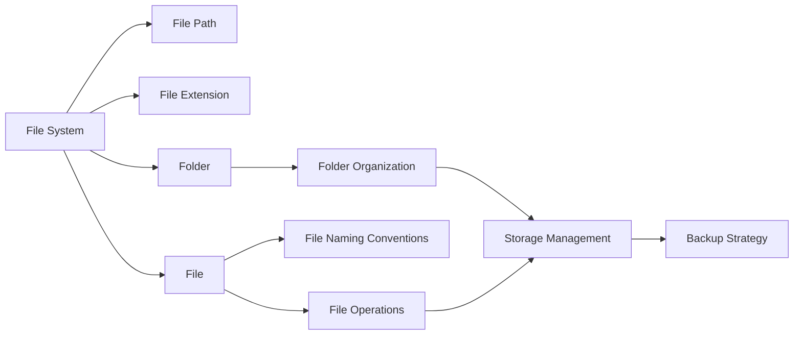

# Concept Map: File Management

## Relationships Between Key Concepts

```mermaid
graph TD
    FM["File Management"] --> FS["File System"]
    FM --> FNC["File Naming Conventions"]
    FM --> FO["Folder Organization"]
    FM --> FOP["File Operations"]
    FM --> SM["Storage Management"]

    FS --> Root["Root Directory"]
    FS --> Hierarchy["Hierarchy / Tree Structure"]
    FS --> FP["File Path"]
    FS --> FE["File Extension"]
    FS --> Folder["Folder / Directory"]
    FS --> File["File"]

    FNC --> Descriptive["Be Descriptive"]
    FNC --> DateFirst["Date First (YYYY-MM-DD)"]
    FNC --> NoSpaces["No Spaces — Use Hyphens"]
    FNC --> NoSpecial["No Special Characters"]
    FNC --> ShortClear["Short But Clear"]

    FO --> ByProject["By Project"]
    FO --> BySubject["By Subject"]
    FO --> ByDate["By Date"]
    FO --> HierarchyDepth["Hierarchy Depth"]

    FOP --> Copy["Copy — Duplicate"]
    FOP --> Move["Move — Transfer"]
    FOP --> Rename["Rename — Change Name"]
    FOP --> Delete["Delete — Remove"]
    FOP --> Undo["Undo — Reverse Action"]

    SM --> HDD["HDD — Hard Disk Drive"]
    SM --> SSD["SSD — Solid State Drive"]
    SM --> Cloud["Cloud Storage"]
    SM --> External["External Storage"]
    SM --> Backup["Backup"]
    SM --> ThreeTwoOne["3-2-1 Backup Rule"]

    Backup --> Original["Original File"]
    Backup --> Copy1["Copy 1 — Same Device"]
    Backup --> Copy2["Copy 2 — Different Media"]
    Backup --> Copy3["Copy 3 — Offsite"]

    File --> FE
    Folder --> FS
    FP --> Root
    FP --> Folder

    Copy --> FOP
    Move --> FOP
    Rename --> FOP
    Delete --> FOP
```



## Concept Dependency Chain



## Bloom's Taxonomy Alignment

| Concept | Remember | Understand | Apply | Analyze |
|---------|----------|------------|-------|---------|
| File System | Define root, hierarchy | Explain tree structure | Navigate folders | Compare organization methods |
| File Naming | List the 5 rules | Explain why rules exist | Name files correctly | Evaluate naming quality |
| Folder Organization | Identify three methods | Explain when to use each | Create folder structures | Design optimal systems |
| File Operations | List shortcuts | Explain copy vs. move | Perform operations | Troubleshoot file issues |
| Storage Management | Name storage types | Explain HDD vs. SSD | Check storage, backup | Evaluate backup strategies |

## Visual Concept Map (Text Representation)

```
                          FILE MANAGEMENT
                               |
          ┌────────────┬───────┴───────┬────────────┐
          |            |               |            |
     FILE SYSTEM  NAMING         ORGANIZATION  OPERATIONS
          |        CONVENTIONS        |            |
     ┌────┼────┐      |          ┌───┼───┐    ┌───┼───┐
     |    |    |      |          |   |   |    |   |   |
   Root Path Ext    Rules    Project Subject Date Copy Move Delete
     |    |    |      |          |   |   |    |   |   |
   Folders Files    5 Rules   Methods   Methods  Shortcuts
                                     |           |
                               STORAGE MANAGEMENT
                                     |
                    ┌────────┬───────┴───────┬────────┐
                    |        |               |        |
                   HDD     SSD            Cloud    External
                    |        |               |        |
                    └────────┴───────┬───────┴────────┘
                                     |
                                  BACKUP
                                     |
                              3-2-1 RULE
```

## Key Relationships

1. **File System** is the foundation — all other concepts depend on understanding how files and folders are organized hierarchically
2. **File Naming Conventions** apply to individual files within the file system
3. **Folder Organization** structures the containers that hold files
4. **File Operations** are actions performed on files within the organized system
5. **Storage Management** addresses where files physically live and how to protect them
6. **Backup** is the outcome of good storage management, implementing the 3-2-1 rule

## Cross-Concept Connections

- **File Path** connects File System to File Operations (you need the path to perform operations)
- **File Extension** connects File System to File Naming (extension is part of the name)
- **Folder Organization** connects to File Path (organization determines the path)
- **Copy** connects File Operations to Storage Management (copying to different media is a backup strategy)
- **Cloud Storage** connects Storage Management to File Operations (uploading and downloading are operations)
