# Concept Map: Software Installation

**Knowledge Package:** KP-004

---

## Mermaid Diagram

```mermaid
graph TD
    KP["KP-004: Software Installation"]

    KP --> C1["Software Types"]
    KP --> C2["Installation Methods"]
    KP --> C3["Software Configuration"]
    KP --> C4["Updates and Patches"]
    KP --> C5["Uninstallation"]

    C1 --> SS["System Software"]
    C1 --> AS["Application Software"]

    SS --> OS["Operating Systems"]
    SS --> UTIL["Utilities"]
    SS --> DRV["Device Drivers"]

    AS --> PROD["Productivity"]
    AS --> CREATIVE["Creative"]
    AS --> COMM["Communication"]
    AS --> ENT["Entertainment"]

    C2 --> WEB["Official Websites"]
    C2 --> STORE["App Stores"]
    C2 --> PKG["Package Managers"]

    WEB --> VERIFY["URL Verification"]
    WEB --> HTTPS["HTTPS Check"]

    STORE --> MS["Microsoft Store"]
    STORE --> UB["Ubuntu Software Center"]
    STORE --> MAC["Mac App Store"]

    PKG --> APT["APT (Linux)"]
    PKG --> CHOC["Chocolatey (Windows)"]
    PKG --> BREW["Homebrew (macOS)"]

    C3 --> PREF["Preferences"]
    C3 --> ACCT["User Accounts"]
    C3 --> PERM["Permissions"]

    PREF --> NOTIFY["Notifications"]
    PREF --> DISPLAY["Display Settings"]
    PREF --> PRIVACY["Privacy Options"]

    PERM --> FILES["File Access"]
    PERM --> NET["Network Access"]
    PERM --> CAM["Camera/Microphone"]

    C4 --> SEC["Security Patches"]
    C4 --> BUG["Bug Fixes"]
    C4 --> FEAT["Feature Updates"]

    SEC --> VULN["Known Vulnerabilities"]
    SEC --> AUTO["Automatic Updates"]

    C5 --> UNINSTALLER["Built-in Uninstaller"]
    C5 --> CLEANUP["Residual File Cleanup"]
    C5 --> RECLAIM["Disk Space Reclamation"]

    INSTALL["Installation Process"] --> EXTRACT["File Extraction"]
    INSTALL --> PLACE["File Placement"]
    INSTALL --> CONFIG["System Configuration"]
    INSTALL --> DEPS["Dependency Setup"]
    INSTALL --> SHORTCUTS["Shortcut Creation"]
    INSTALL --> REGISTER["OS Registration"]

    C2 --> INSTALL

    DEFS["Key Definitions"] --> SW["Software"]
    DEFS --> INST["Installer"]
    DEFS --> ASSTORE["App Store"]
    DEFS --> LIC["License"]
    DEFS --> PAT["Patch"]

    SW --> HW["Hardware"]

    style KP fill:#2196F3,stroke:#1565C0,color:#fff
    style C1 fill:#4CAF50,stroke:#2E7D32,color:#fff
    style C2 fill:#FF9800,stroke:#E65100,color:#fff
    style C3 fill:#9C27B0,stroke:#6A1B9A,color:#fff
    style C4 fill:#F44336,stroke:#C62828,color:#fff
    style C5 fill:#607D8B,stroke:#37474F,color:#fff
    style INSTALL fill:#FFC107,stroke:#FF8F00,color:#000
    style DEFS fill:#00BCD4,stroke:#00838F,color:#fff
```



---

## Relationship Explanations

### Core Relationships

| From | To | Relationship |
|------|----|-------------|
| Software Installation | Software Types | Classifies what is being installed |
| Software Installation | Installation Methods | Determines how software is installed |
| Software Installation | Software Configuration | What happens after installation |
| Software Installation | Updates and Patches | Ongoing maintenance after installation |
| Software Installation | Uninstallation | End of software lifecycle |
| Installation Methods | Installation Process | Methods lead to the installation process |
| Software Types | System Software / Application Software | Two main categories |
| Installation Process | Installation Steps | The 6-step process |

### Supporting Relationships

| From | To | Relationship |
|------|----|-------------|
| App Stores | Package Managers | Alternative centralized installation methods |
| Official Websites | URL Verification | Safety step before downloading |
| Security Patches | Known Vulnerabilities | Patches fix vulnerabilities |
| Built-in Uninstaller | Residual File Cleanup | Uninstallers may leave files behind |
| Hardware | Software | Software requires hardware to run |
| Software | Hardware | Software tells hardware what to do |

### Hierarchical Structure

```
Software Installation
├── Software Types
│   ├── System Software
│   │   ├── Operating Systems
│   │   ├── Utilities
│   │   └── Device Drivers
│   └── Application Software
│       ├── Productivity
│       ├── Creative
│       ├── Communication
│       └── Entertainment
├── Installation Methods
│   ├── Official Websites
│   │   ├── URL Verification
│   │   └── HTTPS Check
│   ├── App Stores
│   │   ├── Microsoft Store
│   │   ├── Ubuntu Software Center
│   │   └── Mac App Store
│   └── Package Managers
│       ├── APT (Linux)
│       ├── Chocolatey (Windows)
│       └── Homebrew (macOS)
├── Software Configuration
│   ├── Preferences
│   ├── User Accounts
│   └── Permissions
├── Updates and Patches
│   ├── Security Patches
│   ├── Bug Fixes
│   └── Feature Updates
└── Uninstallation
    ├── Built-in Uninstaller
    ├── Residual File Cleanup
    └── Disk Space Reclamation
```

---

## Bloom's Taxonomy Alignment

| Level | Concept Application |
|-------|-------------------|
| Remember | Identify software types and definitions |
| Understand | Explain the installation process |
| Apply | Install software using proper procedures |
| Analyze | Compare safe vs. unsafe download sources |
| Evaluate | Assess whether to grant permission requests |
| Create | Build a software installation guide |
