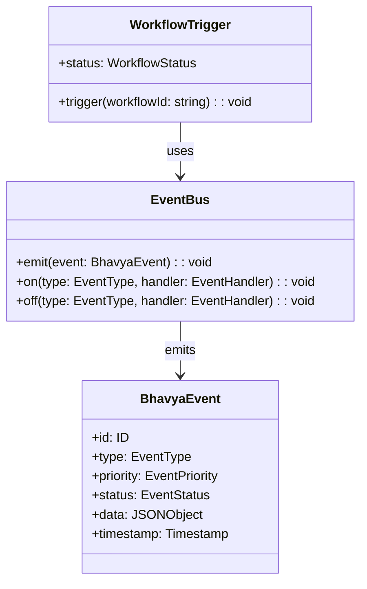

# REASONS Canvas: Mission Runtime Event Bus Integration

## R — Requirements

### Business Context

The canonical app (ai-institute) needs to wire to the mission-runtime package (PKG-002) to enable event-driven communication between the app layer and the runtime engine. This is a prerequisite for TASK-003 (Public APIs) and TASK-005 (Forest GIS).

### Scope

**IN:**

- Import and initialize mission-runtime event bus in ai-institute
- Wire existing workflow triggers to event bus
- Add event handlers for academy-specific events
- Update task graph to reflect new dependencies

**OUT:**

- No new event types (use existing `@bhavya/shared` types)
- No new packages
- No database schema changes
- No new routes

### Success Criteria

- [ ] Event bus initializes on app boot
- [ ] Existing workflow triggers emit events
- [ ] Academy events are handled by mission-runtime
- [ ] No regression in existing functionality
- [ ] All verification gates pass

### Constraints

| Type      | Constraint                                      | Source                                  |
| --------- | ----------------------------------------------- | --------------------------------------- |
| Technical | Must use `@bhavya/mission-runtime` exports only | `contracts/mission-runtime/CONTRACT.md` |
| Technical | No new dependencies                             | AGENTS.md Principle 2                   |
| Technical | Must pass AntiSlop, typecheck, lint, build      | CI pipeline                             |
| Business  | Zero-downtime migration                         | Deployment standards                    |
| Design    | No UI changes for this task                     | Scope definition                        |

---

## E — Entities



### Entity Definitions

| Entity          | Purpose               | Key Fields               | Relationships       |
| --------------- | --------------------- | ------------------------ | ------------------- |
| EventBus        | Central event routing | handlers, queue          | Emits BhavyaEvent   |
| BhavyaEvent     | Event instance        | id, type, priority, data | Created by triggers |
| WorkflowTrigger | Initiates workflows   | workflowId, status       | Uses EventBus       |

---

## A — Approach

### Strategy

Synchronous event emission with async handlers. The event bus is initialized once at app boot and shared via module scope. No persistent queue needed for v0.5.

### Trade-offs

| Decision          | Chosen                  | Rejected                   | Reason                              |
| ----------------- | ----------------------- | -------------------------- | ----------------------------------- |
| Event persistence | In-memory only          | SQLite queue               | v0.5 scope, add persistence in v0.6 |
| Handler execution | Async (fire-and-forget) | Sync (wait for completion) | Performance, non-blocking           |
| Error handling    | Log + continue          | Retry + dead-letter        | Simplicity for v0.5                 |

### Architecture Impact

- **Packages affected:** `apps/ai-institute`
- **Routes affected:** None
- **Contracts affected:** `contracts/mission-runtime/CONTRACT.md` (read-only, no changes)
- **Database changes:** None

---

## S — Structure

### File Layout

```
apps/ai-institute/src/
  ├── lib/
  │   ├── runtime-init.ts        # Initialize mission-runtime
  │   └── event-handlers.ts      # Academy event handlers
  └── app/
      └── layout.tsx             # Import runtime-init
```

### Dependencies

| Component      | Depends On                     | Type   |
| -------------- | ------------------------------ | ------ |
| runtime-init   | `@bhavya/mission-runtime`      | import |
| event-handlers | `@bhavya/shared` (Event types) | import |
| layout.tsx     | runtime-init                   | import |

### Interfaces

```typescript
// initializeRuntime — boot the event bus
function initializeRuntime(): EventBus;

// handleAcademyEvent — process academy-specific events
function handleAcademyEvent(event: BhavyaEvent): void;
```

---

## O — Operations

### Step 1: Create runtime initialization module

1. **Responsibility:** Initialize mission-runtime event bus at app boot
2. **Location:** `apps/ai-institute/src/lib/runtime-init.ts`
3. **Dependencies:** `@bhavya/mission-runtime`
4. **Input:** None (called once at boot)
5. **Output:** Initialized EventBus instance
6. **Error handling:** Log initialization failure, do not crash app

### Step 2: Create academy event handlers

1. **Responsibility:** Handle events specific to the academy domain
2. **Location:** `apps/ai-institute/src/lib/event-handlers.ts`
3. **Dependencies:** `@bhavya/shared` (BhavyaEvent, EventType)
4. **Input:** BhavyaEvent instances
5. **Output:** Side effects (state updates, notifications)
6. **Error handling:** Log handler errors, do not propagate to event bus

### Step 3: Wire initialization to app layout

1. **Responsibility:** Call initializeRuntime() during app boot
2. **Location:** `apps/ai-institute/src/app/layout.tsx`
3. **Dependencies:** runtime-init module
4. **Input:** App boot
5. **Output:** Runtime initialized before first render
6. **Error handling:** Runtime init failure logged, app continues without events

### Execution Order

```text
Step 1 (runtime-init) → Step 3 (layout.tsx)
Step 2 (event-handlers) → Step 1 (registered during init)
```

---

## N — Norms

### Code Standards

- Follow TypeScript strict mode (no `any`)
- Follow existing patterns in `apps/ai-institute/src/lib/`
- Import types from `@bhavya/shared`, never redefine

### Design Standards

- No UI changes in this task
- No new design tokens needed

### Bhavya-Specific Norms

- No new packages (use existing `@bhavya/mission-runtime`)
- No app-to-app dependencies
- No fabricated data
- Follow AntiSlop Tier 2 rules

---

## S — Safeguards

### Hard Constraints

- Do not modify `@bhavya/mission-runtime` package code
- Do not modify `@bhavya/shared` type definitions
- Do not add new npm dependencies
- Do not create new database tables

### Scope Boundaries

- Do not touch files outside `apps/ai-institute/src/`
- Do not refactor existing workflow code as part of this change
- Do not add new routes

### Quality Boundaries

- Do not weaken types to make code compile
- Do not swallow errors silently (log them)
- Do not add placeholder implementations
- Do not introduce patterns not already used in ai-institute

### Anti-Slop Check

- [ ] R-A1: Smallest viable change made
- [ ] R-A2: Existing patterns reused
- [ ] R-A3: No unjustified dependencies
- [ ] R-A4: No invented architecture
- [ ] R-A5: Errors investigated, not swallowed
- [ ] R-A6: Types not weakened for compilation
- [ ] R-A7: Diff inspected before completion

---

## Verification Requirements

### Before Implementation

- [ ] Canvas reviewed by human
- [ ] Repository state inspected (actual code, not assumptions)
- [ ] `contracts/mission-runtime/CONTRACT.md` checked
- [ ] Existing patterns in `apps/ai-institute/src/lib/` identified

### After Implementation

- [ ] AntiSlop gate passes (`pnpm antislop`)
- [ ] Typecheck passes (`pnpm typecheck`)
- [ ] Lint passes (`pnpm lint`)
- [ ] Tests pass (`pnpm test`)
- [ ] Build succeeds (`pnpm build`)
- [ ] Canvas matches implementation (drift check)

### Drift Detection

| Canvas Says               | Code Actually Does  | Status  |
| ------------------------- | ------------------- | ------- |
| runtime-init.ts created   | (verify after impl) | PENDING |
| event-handlers.ts created | (verify after impl) | PENDING |
| layout.tsx modified       | (verify after impl) | PENDING |

---

## Design Contract Summary

| Field                | Value       |
| -------------------- | ----------- |
| **Task ID**          | TASK-002    |
| **Status**           | draft       |
| **Owner**            | Engineering |
| **Created**          | 2026-09-14  |
| **Last verified**    | —           |
| **Repository state** | current     |
